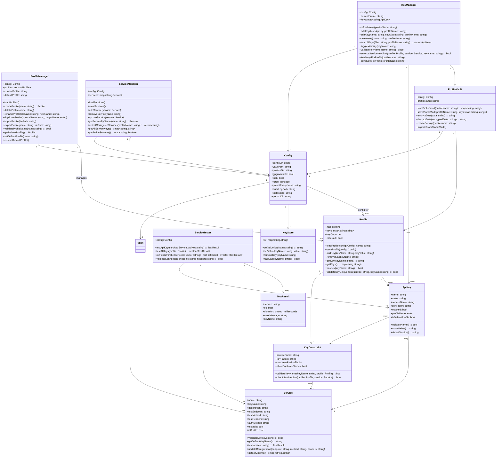

# AK App Class Diagram

## Key Design Decisions

### 1. **Profile-Centric Architecture**
- Profiles serve as containers for collections of API keys
- Each profile represents a specific environment or use case
- Profiles enforce the "one service API key per profile" constraint

### 2. **Service Abstraction**
- Abstract Service class allows for both built-in and custom services
- BuiltinService for predefined services (OpenAI, Anthropic, etc.)
- CustomService for user-defined services with configurable endpoints

### 3. **Key Constraint System**
- KeyConstraint class enforces business rules
- Prevents duplicate service keys within a profile unless different names are used
- Validates key naming patterns and service limits

### 4. **Flexible Key Naming**
- Users can have multiple keys for the same service using different names
- Example: `OPENAI_API_KEY`, `OPENAI_API_KEY_2`, `OPENAI_API_KEY_PROD`
- Maintains service association while allowing flexibility

### 5. **Testing Integration**
- ServiceTester provides API key validation
- TestResult captures test outcomes
- Supports both individual and batch testing

### 6. **Secure Storage**
- Vault handles encrypted storage via GPG
- KeyStore provides key-value storage abstraction
- Supports both encrypted and plain text storage modes